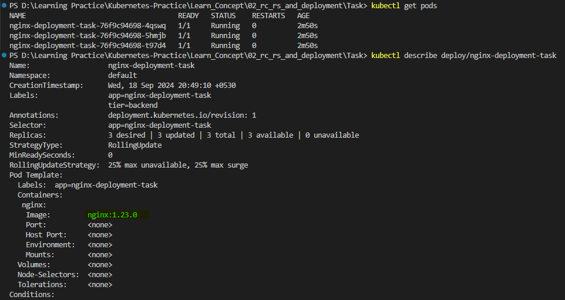
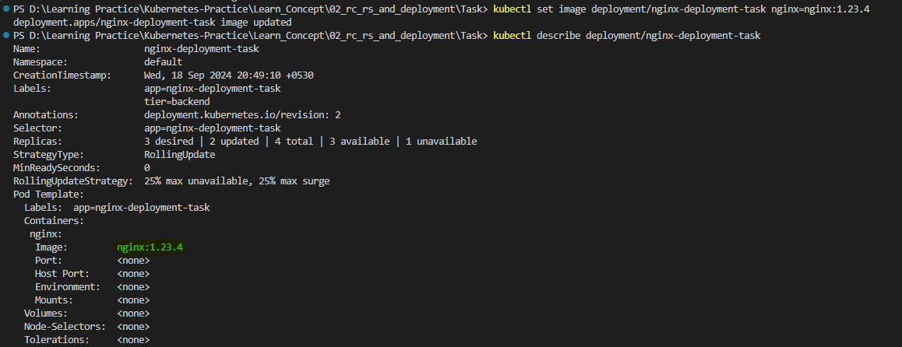

Replicaset
Create a new Replicaset based on the nginx image with 3 replicas
Update the replicas to 4 from the YAML
Update the replicas to 6 from the command line

Deployment
1. Create a Deployment named nginx with 3 replicas. The Pods should use the nginx:1.23.0 image and the name nginx. The Deployment uses the label tier=backend. The Pod template should use the label app=v1.
2. List the Deployment and ensure the correct number of replicas is running.
3. Update the image to nginx:1.23.4.
4. Verify that the change has been rolled out to all replicas.
5. Assign the change cause "Pick up patch version" to the revision.
Scale the Deployment to 5 replicas.
Have a look at the Deployment rollout history.
Revert the Deployment to revision 1.
Ensure that the Pods use the image nginx:1.23.0.

Answers as follows:
1. 2.  

3. 