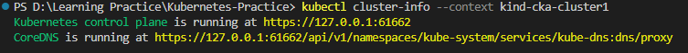
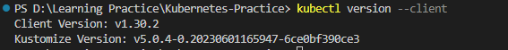
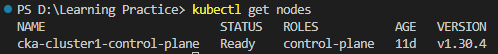
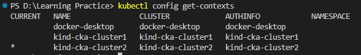
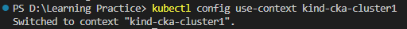

# Kubernetes Multi Node Cluster Setup

### Create Cluster
Using "kind create cluster" command we can create a cluster. 

This will bootstrap a Kubernetes cluster using a pre-built node image. Prebuilt images are hosted "atkindest/node", but to find images suitable for a given release currently you should check the release notes for your given kind version (check with kind version) where you’ll find a complete listing of images created for a kind release.

release notes : https://github.com/kubernetes-sigs/kind/releases

To specify another image use the 
```
--image flag – kind create cluster --image=...
```

We can write create cluster command as below. If we don't specify the name, it will automatically get cluster name as "kind"
```
kind create cluster --image v1.30.3: kindest/node:v1.30.3@sha256:bf91e1ef2f7d92bb7734b2b896b3dddea98f0496b34d96e37dd5d7df331b7e56 --name cka-cluster1
```
We can get details from a particular cluster using below command.
```
kubectl cluster-info --context kind-cka-cluster1
```


We can use below command to get the running client version information for the current context.
```
kubectl version --client
```


with below command we can list the existing nodes in the cluster. 
A Node is a worker machine in Kubernetes and may be either a virtual or a physical machine, depending on the cluster.
```
kubectl get nodes
```


### Multi-node clusters

We should specify a configuration file when creating a Multi-node cluster.
Below is the contect for three node (one control-plane and two workers) cluster config (config.yaml).
```
kind: Cluster
apiVersion: kind.x-k8s.io/v1alpha4
nodes:
- role: control-plane
- role: worker
- role: worker
```
Using below command we can create Multinode cliuster specified in above config file. we can reuse the same command we use above. Let's change the name of the cluster to "cka-cluster2" and we will be using the same image. If you need to change the image parameter you can change it accordingly using the release notes. But in here we are using another additional parameter which is refering this config.yaml file.

This cluster should have 3 nodes, one for control plane and two for worder nodes.

```
kind create cluster --image v1.30.3: kindest/node:v1.30.3@sha256:bf91e1ef2f7d92bb7734b2b896b3dddea98f0496b34d96e37dd5d7df331b7e56 --name cka-cluster2 --config config.yaml
```

Use below command to list existing clusters.
```
kubectl config get-contexts
```


Using below command we can switch between clusters.
```
kubectl config use-context <cluster-name>
kubectl config use-context kind-cka-cluster1
```

