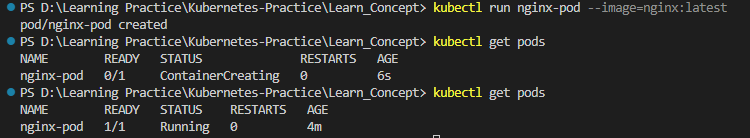

# Imperative VS Declarative | Pod in Kubernetes | YAML 

### Imperative vs Declarative

Imperative configuration involves creating Kubernetes resources directly at the command line against a Kubernetes cluster. Declarative configuration defines resources within manifest files (It's like a configuration file) and then applies those definitions to the cluster.


Create and run a particular image in a pod.

```
kubectl run NAME --image=image [--env="key=value"] [--port=port] [--dry-run=server|client] [--overrides=inline-json] [--command] -- [COMMAND] [args...]
```

Let's create an nginx pod using imperative way.

```
kubectl run nginx-pod --image=nginx:latest
```
Pod is directly don't go into the running state it goes into container creating state and then goes to running state.-



Let's create a pod using declarative way. For that we need to create a yaml file. yaml file extension can be ".yml as well as .yaml".

```
apiVersion: v1
kind: Pod
metadata: 
  name: nginx-pod-yaml
  labels: 
    env: demo-pod
spec: 
  containers: 
  - name: nginx-container
    image: nginx
    ports: 
    - containerPort: 80
```

In here ```metadata:``` and ```spec:``` are dictionary data type and ```containers:``` is a list data type.


We can use Execute a command in a container to go inside to container.

```
kubectl exec (POD | TYPE/NAME) [-c CONTAINER] [flags] -- COMMAND [args...]
```

```
kubectl exec -it nginx-pod-yaml -- sh
```


#### Create your own yaml

We can write our imperative command and then we can output it in a yaml format.

We can use the ``` --dry-run=client ``` flag to preview the object that would be sent to our cluster, without really submitting it. It'll show you what will happen once run this command without applying it.

```
kubectl run nginx --image=nginx --dry-run=client
```

With this dry-run we can output this to a yaml file. 

```
kubectl run nginx --image=nginx --dry-run=client -o yaml
```

This means share me the output of this in a yaml format. Once run this it will show us the yaml format of it.


With below command we can redirect this to a yaml file.

```
kubectl run nginx --image=nginx --dry-run=client -o yaml > pod-new.yaml
```


Then we can do the changers accordingly as per our requirements and our preferences. Then we can go ahead and apply this yaml.


Labels are really helpful to group our resources together. Let's say we have 100s of pods running and we want to know about all the pods are part of frontend application. We can just retrieve the information using labels tab. 

Let's check the labels of a particular pod.


Let's say we want to know on which node our pod is running. we can retrieve that with ```kubectl describe``` command as well. But with below command we can get all the extended information about a particular object.

```
kubectl get pods -o wide
```


Same for the nodes we can use above commands to get the information about nodes as well.

```
kubectl get nodes
kubectl get nodes -o wide
```
