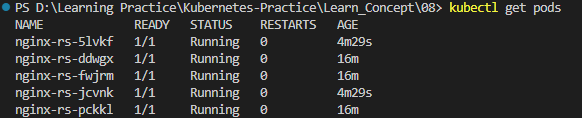
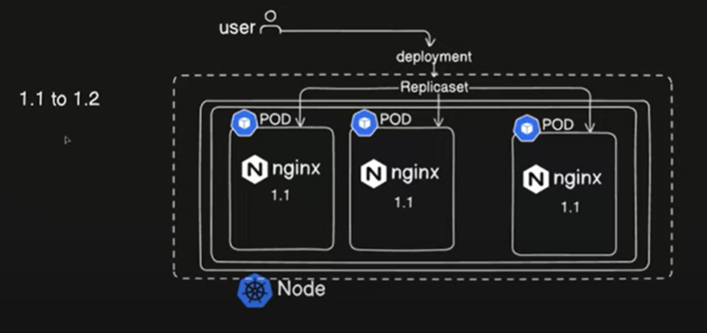
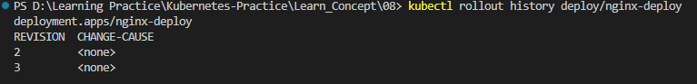
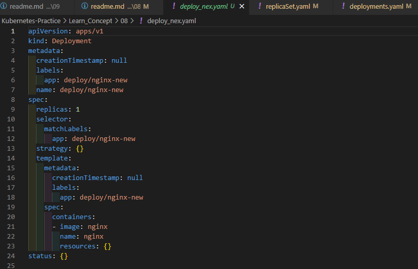

# Deployment, Replication Controller and ReplicaSet

### Replication Controller

One thing that we should make sure when running an application is we should make sure that user does not get an empty response even if the application crashes. 

Since we are using an orchestration system, it should have the ability to auto-heal the application or automatically spin up a new pod when an existing pod crashes. This ensures minimal downtime and seamless user experience.

The replication controller plays a key role in this by automatically creating a new pod (if specified) whenever a pod crashes. For high availability, it keeps multiple replicas of the same pods running simultaneously. This ensures that if one pod fails, a replica can seamlessly take over, preventing any disruption to the system.


Let's assume that it makes sure our application is highly available all the time because now we are not redirecting traffing to just one pod and we are redirecting traffic to replication controller. Replication controller has the load balancing logic and it responsible for redirecting the traffic to one of the active pad. Pods are running behind the replication controller and replication controller is responsible for redirecting traffic to one of the active pod. it has different mechanism like, it will check which pod is active or which pod is healthy and it will redirect the traffic using this load balancing algorithm to which it finds the most healthy pods.

Let's say if we have specified replicas as three. So it will make sure that we always have three replicas running, we always have ruuning three instances of that pod running all the time. So if one failes it spin up one and if two failes it spin up two pods. 

Let's say if we increase the resources and a particular node does not have enough resources. Because what pods are doing is they share the resources from the node. like CPU, memory, storage...etc everything shares from the node. let's assume it reaches to a point where the particular node is running out of the capacity. In that case what we can do is we can spin up a new node and we provision pod in the new node. Because this replication controller we are using can span multiple nodes. 


Let's create replication controller yaml file.

```
apiVersion: v1
kind: ReplicationController
metadata:
  name: nginx-rc
  labels: 
    env: demo
spec:
  template:
    metadata: 
      labels: 
        env: demo
      name: nginx
    spec:
      containers:
      - image: nginx
        name: nginx-rcpod
  replicas: 3 
```

We can apply above yaml using below command.

```
kubectl apply -f replication_controller.yaml
```


If we want to check the specification of the replication controller or the pods we can use below command.

```
kubectl describe pod nginx-rc-2mgsp
```

It will show you all the information about the pod, we mentioned in the command. If we does not specify a name, then it will show you all the information about all the pods in the node.


### ReplicaSet

Different between Replication Controller and ReplicaSet is replication controller will only be used to manage the resources of the pods that were created as part of that particular replica controller, but with  ReplicaSet we can manage the existing pods as well, that were not part of the particular ReplicaSet. That is done with the help of another field called selector. Inside the selector we match labels. Match the labels of the pods that want to be part of the particular ReplicaSet.

* Replication Controller is the legacy version. Replica Set is the never verison. 
* Replication Controller is only be use to manage the resources the pods that were created as part of that Replica Controller.
* But with Replica Set we can manage the existing pods as well.
* We do that with the help of the another field called selector. Inside that we do match labels. 
* So we match the labels of the pods that we want to be part of this perticular replica set.


As an example, let's define environment as demo inside the matchLabels. Every pod that is running with this particular label will now be managed by the ReplicaSet. 

Let's create ReplicaSet using below yaml file.

```
apiVersion: apps/v1   # group/version - here we have to specify the group as well
kind: ReplicaSet
metadata: 
  name: nginx-rs
  labels:
    env: demo
spec: 
  template:
    metadata:
      labels: 
        env: demo
      name: nginx
    spec:
      containers:
      - image: nginx
        name: nginx-rspod
  replicas: 3
  selector: 
    matchLabels: 
      env: demo   
```

Apply the yaml file using below command.

```
kubectl apply -f replicaSet.yaml
```


Here you can see three pods I have highlited in green color are pods which already part of the replication controller.

Let's delete the replication controller with below command.

```
kubectl delete rc/nginx-rc
```


* If we need to change the count of replicas, we can do the change in yaml file "replica: 5" and save and apply the change again. Then it will get apply the change make the change instantly. 

* Another way of do this change is instead of updating the yaml file you can do the change live object. Instead of the updating yaml file we can use below command. It will open a live object yaml and we can edit and update the live object yaml file and save it. As soon as we close the yaml file it will show us the message as in the below image. It will update it automatically. we don't need to apply it again.

```
kubectl edit rs/nginx-rs
```


Now we can see pod count is updated as we update above.



* Another way is update the pods count is scale command. we can use scale command to update pods count as below.


### Deployment

Deployment provides an additional functionality to the ReplicaSet. Let's assume these pods are running version 1.1 of engine X because these all are identical pods that means they will be running on the same version as they are part of the same template, and we have to update the version from 1.1 to 1.2. For that we need to roll out the changes.

If we were running the replica set it would apply the changes and it will recreate the Pod all at once and our user will face the downtime. Our active live users on the application will face the downtime for that brief period. 

With deployment we can make the changes in a rolling update fashion so it will update one particular pod over the all pods and while that particular pod is getting updated the traffic is being served from other pods. 

Also it can spin up a new pod to take care of the the traffic that is part of the updating pod until it is up and running. Once the updated pod is up and running it will add it to the load balancer or add it to the ReplicaSet and start serving the traffic. this is the benefit that we get with deployment and we can also roll back the changes to a particular revision or we can undo the changes that have just been done.



Now let's create deployment by applying below deployment yaml.

```
apiVersion: apps/v1 
kind: Deployment
metadata: 
  name: nginx-deploy
  labels:
    env: deploy-demo
spec: 
  template:
    metadata:
      labels: 
        env: deploy-demo
      name: nginx
    spec:
      containers:
      - image: nginx
        name: nginx-rspod
  replicas: 3
  selector: 
    matchLabels: 
      env: deploy-demo 
```

Apply the yaml file with below command

```
kubectl apply -f .\deployments.yaml
```

Now you can check the current existing pods, ReplicaSets, and Deplyment with below commands.

```
kubectl get pods
kubectl get rs
kubectl get deploy
```
Before apply, I have deleted the current ReplicaSet we have created a while ago.


Below command will return all the objects that are running in our cluster.

```
kubectl get all
```


Now let's do some changers in the image. We can do it two ways.
* Do the change in yaml file and apply it again
* Use commandline to apply change

Let's use the second method to change the image version. with below command we can get all the information about objects in the deployment.

```
kubectl describe deploy/nginx-deploy
```

Here we can see version is not specify since it is using the latest version. Let's change it to version 1.9.1


Let's do the change with below commands:
```
kubectl set image deploy/nginx-deploy nginx-rspod=nginx:1.26.2
```


Let's check the rollout history with below command.

```
kubectl rollout history deploy/nginx-deploy
```

It shows two revisions. One is the default revision, when we created the object. Second one is when we made the changes.


We can undo the changes(rollback the changes) we have done with below command. 

```
kubectl rollout undo deploy/nginx-deploy
```

If we describe the deployment now, we can see the changes we have done has been rolledback to previous version.


If we check the rollout history now it will display a new revision.



#### Create a yaml from dry run

Let's do a dry-run first to create above deployment, and we should specify the image we use as well.

```
kubectl create deploy deploy/nginx-new --image=nginx --dry-run=client
```


Now let's generate the yaml file with below command. add -o yaml to generate a yaml of it and redirect the yaml in to new file > deploy_nex.yaml

```
kubectl create deploy deploy/nginx-new --image=nginx --dry-run=client -o yaml > deploy_nex.yaml
```


