## 09 Task

1. Create a Service named myapp of type ClusterIP that exposes port 80 and maps to the target port 80.

2. Create a Deployment named myapp that creates 1 replica running the image nginx:1.23.4-alpine. Expose the container port 80.

3. Scale the Deployment to 2 replicas.

4. Create a temporary Pod using the image busybox and run a wget command against the IP of the service.

5. Run a wget command against the service outside the cluster.

6. Change the service type so the Pods can be reached outside the cluster.

7. Run a wget command against the service outside the cluster.

8. Discuss: Can you expose the Pods as a service without a deployment?

9. Discuss: Under what condition would you use the service types LoadBalancer, node port, clusterIP, and external?


1. Create a Service named myapp of type ClusterIP that exposes port 80 and maps to the target port 80.

Create below yaml file to create ClusterIP and apply it.

```
apiVersion: v1
kind: Service
metadata: 
  name: myapp
  labels: 
    env: task-service
spec: 
  type: ClusterIP
  ports: 
  - port: 80
    targetPort: 80
  selector: 
    app: myapp
```

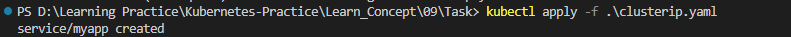

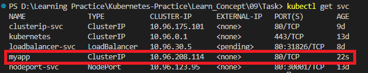


2. Create a Deployment named myapp that creates 1 replica running the image nginx:1.23.4-alpine. Expose the container port 80.

```
apiVersion: apps/v1
kind: Deployment
metadata:
  creationTimestamp: null
  labels:
    app: myapp
  name: myapp
spec:
  replicas: 1
  selector:
    matchLabels:
      app: myapp
  template:
    metadata:
      creationTimestamp: null
      labels:
        app: myapp
    spec:
      containers:
      - image: nginx:1.23.4-alpine
        name: nginx-task-09
        ports: 
        - containerPort: 80
```

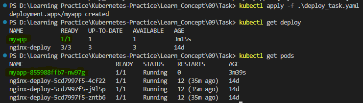

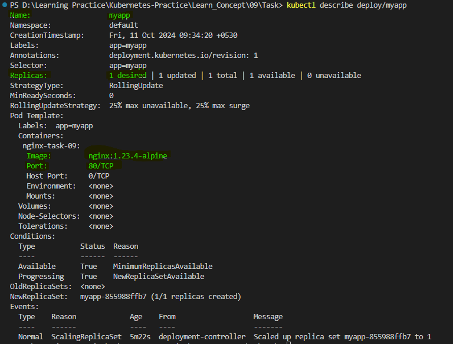


3. Scale the Deployment to 2 replicas.

```
kubectl scale deployment myapp --replicas=2
```

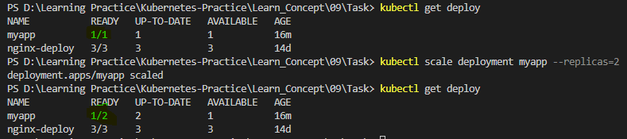


4. Create a temporary Pod using the image busybox and run a wget command against the IP of the service.

We can create a temporary Pod using below command.

```
kubectl run busybox --image=busybox --rm -it --restart=Never -- bin/sh
```
* ```run busybox:``` This creates a Pod named busybox.

* ```--image=busybox:``` Specifies the container image to use, which is the minimal Linux distribution BusyBox.

* ```--rm:``` Automatically deletes the Pod once the command has completed. It helps in running temporary containers that clean up themselves after usage.

* ```-it:``` Combines two flags:
  * ```-i:``` Keeps the stdin open, allowing interaction with the container.
  * ```-t:``` Allocates a pseudo-TTY (terminal), useful for an interactive shell session.
Together, -it makes this an interactive terminal session.

* ```--restart=Never:``` Ensures that a simple Pod is created (not a Deployment or Job) and that the Pod will not automatically restart after it finishes.

* ```-- /bin/sh:``` The command that is executed inside the container. This starts an interactive shell (/bin/sh) session within the BusyBox container.

Once we run above command, a temporary BusyBox Pod will run with name busybox, opens an interactive shell (/bin/sh) for you to work in, and then removes the Pod when you exit the shell.

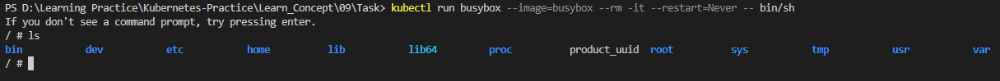

To run a wget command against the IP of the service, we have to add below part to the command or we can run below part after opens the interactive shell.

Firrst get the IP address of Cluster IP with below command.
```
kubectl get svc
```

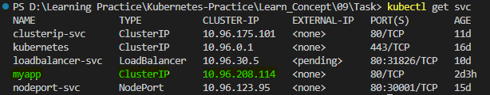

Then We can add below part to the above command we run with the IP address we get from the services.
```
-c "wget -qO- 10.96.208.114"
```

* ```/bin/sh -c "wget -qO- <service-ip>":``` Runs the wget command to make a request to the service's IP, with -qO- meaning quiet mode with output to standard out.

* ```-c``` option is used in shell commands like /bin/sh (or bash), and it stands for command. It allows you to pass a string as a command ```wget -qO- 10.96.208.114``` for the shell to execute.
  * When you run ```/bin/sh -c "<command>"```, the shell (/bin/sh) will execute the string inside the quotes as if it were typed directly into the shell.
  * ```wget -qO- 10.96.208.114:``` This is the actual command being passed to the shell. Here, wget is used to make an HTTP request to 10.0.0.50.

```
kubectl run busybox --image=busybox --rm -it --restart=Never -- bin/sh -c "wget -qO- 10.96.208.114"
```
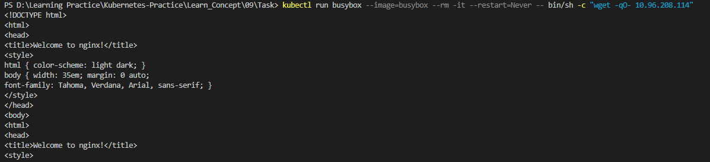

Below is the Output we are grtting with above command.

```
<!DOCTYPE html>
<html>
<head>
<title>Welcome to nginx!</title>
<style>
html { color-scheme: light dark; }
body { width: 35em; margin: 0 auto;
font-family: Tahoma, Verdana, Arial, sans-serif; }
</style>
</head>
<body>
<html>
<head>
<title>Welcome to nginx!</title>
<style>
html { color-scheme: light dark; }
body { width: 35em; margin: 0 auto;
font-family: Tahoma, Verdana, Arial, sans-serif; }
</style>
</head>
<body>
html { color-scheme: light dark; }
body { width: 35em; margin: 0 auto;
font-family: Tahoma, Verdana, Arial, sans-serif; }
</style>
</head>
<body>
</style>
</head>
<body>
</head>
<body>
<body>
<h1>Welcome to nginx!</h1>
<p>If you see this page, the nginx web server is successfully installed and
working. Further configuration is required.</p>

working. Further configuration is required.</p>

<p>For online documentation and support please refer to
<a href="http://nginx.org/">nginx.org</a>.<br/>
Commercial support is available at
<a href="http://nginx.com/">nginx.com</a>.</p>

<p><em>Thank you for using nginx.</em></p>
</body>
</html>
pod "busybox" deleted
<p>For online documentation and support please refer to
<a href="http://nginx.org/">nginx.org</a>.<br/>
Commercial support is available at
<a href="http://nginx.com/">nginx.com</a>.</p>

<p><em>Thank you for using nginx.</em></p>
<p>For online documentation and support please refer to
<a href="http://nginx.org/">nginx.org</a>.<br/>
Commercial support is available at
<p>For online documentation and support please refer to
<a href="http://nginx.org/">nginx.org</a>.<br/>
<p>For online documentation and support please refer to
<p>For online documentation and support please refer to
<a href="http://nginx.org/">nginx.org</a>.<br/>
Commercial support is available at
<a href="http://nginx.com/">nginx.com</a>.</p>

<p><em>Thank you for using nginx.</em></p>
</body>
</html>
pod "busybox" deleted
```

We can run a wget command against the IP of the service after we interract with shell as well.

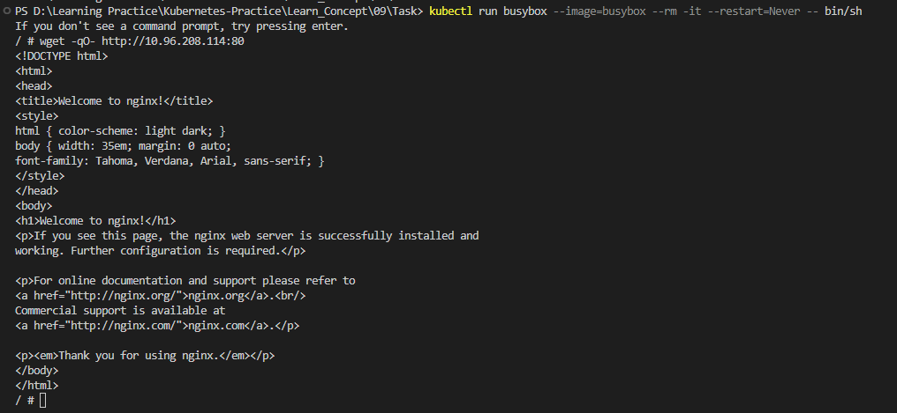

#### Note

To aquire above output ```selector:``` of our clusterip.yaml and ```labels``` of pods in the deployment should be same. When I run the command first time it pop up the below error for me. 

```
If you don't see a command prompt, try pressing enter.
wget: can't connect to remote host (10.96.208.114): Connection refused
pod "busybox" deleted
pod default/busybox terminated (Error)
```
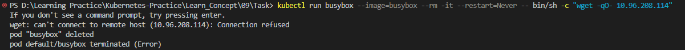

I didn't get endpoints of the pods from ```kubectl describe svc/myapp``` command.

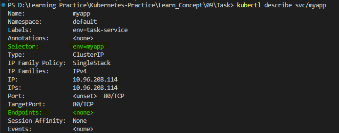

```labels``` of pods were ```app: myapp``` not ```env: myapp```

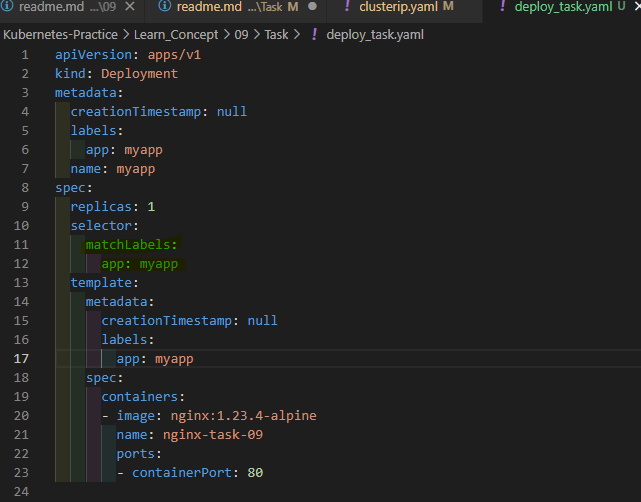

After done the change, in ClusterIP endpoints were appears.

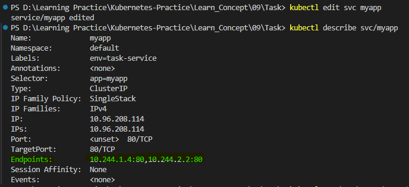