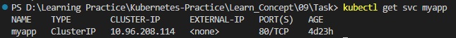
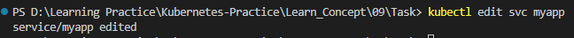
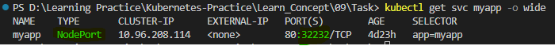
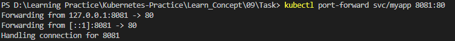
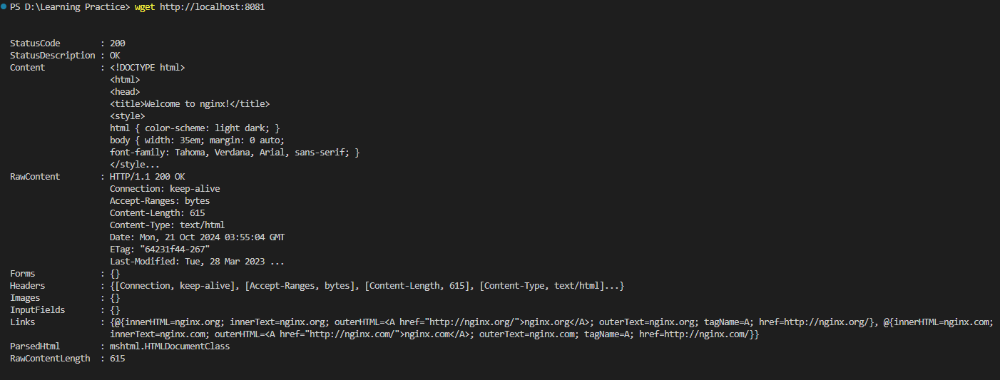
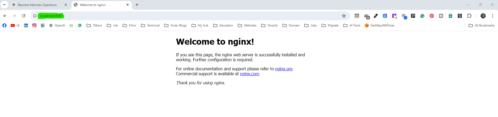

## 09 Task

1. Create a Service named ```myapp``` of type ClusterIP that exposes port 80 and maps to the target port 80.

2. Create a Deployment named ```myapp``` that creates 1 replica running the image ```nginx:1.23.4-alpine```. Expose the container port 80.

3. Scale the Deployment to 2 replicas.

4. Create a temporary Pod using the image ```busybox``` and run a ```wget``` command against the IP of the service.

5. Run a ```wget``` command against the service outside the cluster.

6. Change the service type so the Pods can be reached outside the cluster.

7. Run a ```wget``` command against the service outside the cluster.

8. Discuss: Can you expose the Pods as a service without a deployment?

9. Discuss: Under what condition would you use the service types ```LoadBalancer```, ```nodePort```, ```clusterIP```, and ```external```?


### Answers:

### 1. Create a Service named myapp of type ClusterIP that exposes port 80 and maps to the target port 80.

Create below yaml file to create ClusterIP and apply it.

```
apiVersion: v1
kind: Service
metadata: 
  name: myapp
  labels: 
    env: task-service
spec: 
  type: ClusterIP
  ports: 
  - port: 80
    targetPort: 80
  selector: 
    app: myapp
```


### 2. Create a Deployment named myapp that creates 1 replica running the image nginx:1.23.4-alpine. Expose the container port 80.

```
apiVersion: apps/v1
kind: Deployment
metadata:
  creationTimestamp: null
  labels:
    app: myapp
  name: myapp
spec:
  replicas: 1
  selector:
    matchLabels:
      app: myapp
  template:
    metadata:
      creationTimestamp: null
      labels:
        app: myapp
    spec:
      containers:
      - image: nginx:1.23.4-alpine
        name: nginx-task-09
        ports: 
        - containerPort: 80
```


### 3. Scale the Deployment to 2 replicas.

```
kubectl scale deployment myapp --replicas=2
```


### 4. Create a temporary Pod using the image busybox and run a wget command against the IP of the service.

We can create a temporary Pod using below command.

```
kubectl run busybox --image=busybox --rm -it --restart=Never -- bin/sh
```
* ```run busybox:``` This creates a Pod named busybox.

* ```--image=busybox:``` Specifies the container image to use, which is the minimal Linux distribution BusyBox.

* ```--rm:``` Automatically deletes the Pod once the command has completed. It helps in running temporary containers that clean up themselves after usage.

* ```-it:``` Combines two flags:
  * ```-i:``` Keeps the stdin open, allowing interaction with the container.
  * ```-t:``` Allocates a pseudo-TTY (terminal), useful for an interactive shell session.
Together, -it makes this an interactive terminal session.

* ```--restart=Never:``` Ensures that a simple Pod is created (not a Deployment or Job) and that the Pod will not automatically restart after it finishes.

* ```-- /bin/sh:``` The command that is executed inside the container. This starts an interactive shell (/bin/sh) session within the BusyBox container.

Once we run above command, a temporary BusyBox Pod will run with name busybox, opens an interactive shell (/bin/sh) for you to work in, and then removes the Pod when you exit the shell.


To run a wget command against the IP of the service, we have to add below part to the command or we can run below part after opens the interactive shell.

Firrst get the IP address of Cluster IP with below command.

```
kubectl get svc
```


Then We can add below part to the above command we run with the IP address we get from the services.
```
-c "wget -qO- 10.96.208.114"
```

* ```/bin/sh -c "wget -qO- <service-ip>":``` Runs the wget command to make a request to the service's IP, with -qO- meaning quiet mode with output to standard out.

* ```-c``` option is used in shell commands like /bin/sh (or bash), and it stands for command. It allows you to pass a string as a command ```wget -qO- 10.96.208.114``` for the shell to execute.
  * When you run ```/bin/sh -c "<command>"```, the shell (/bin/sh) will execute the string inside the quotes as if it were typed directly into the shell.
  * ```wget -qO- 10.96.208.114:``` This is the actual command being passed to the shell. Here, wget is used to make an HTTP request to 10.0.0.50.

```
kubectl run busybox --image=busybox --rm -it --restart=Never -- bin/sh -c "wget -qO- 10.96.208.114"
```


Below is the Output we are grtting with above command.

```
<!DOCTYPE html>
<html>
<head>
<title>Welcome to nginx!</title>
<style>
html { color-scheme: light dark; }
body { width: 35em; margin: 0 auto;
font-family: Tahoma, Verdana, Arial, sans-serif; }
</style>
</head>
<body>
<html>
<head>
<title>Welcome to nginx!</title>
<style>
html { color-scheme: light dark; }
body { width: 35em; margin: 0 auto;
font-family: Tahoma, Verdana, Arial, sans-serif; }
</style>
</head>
<body>
html { color-scheme: light dark; }
body { width: 35em; margin: 0 auto;
font-family: Tahoma, Verdana, Arial, sans-serif; }
</style>
</head>
<body>
</style>
</head>
<body>
</head>
<body>
<body>
<h1>Welcome to nginx!</h1>
<p>If you see this page, the nginx web server is successfully installed and
working. Further configuration is required.</p>

working. Further configuration is required.</p>

<p>For online documentation and support please refer to
<a href="http://nginx.org/">nginx.org</a>.<br/>
Commercial support is available at
<a href="http://nginx.com/">nginx.com</a>.</p>

<p><em>Thank you for using nginx.</em></p>
</body>
</html>
pod "busybox" deleted
<p>For online documentation and support please refer to
<a href="http://nginx.org/">nginx.org</a>.<br/>
Commercial support is available at
<a href="http://nginx.com/">nginx.com</a>.</p>

<p><em>Thank you for using nginx.</em></p>
<p>For online documentation and support please refer to
<a href="http://nginx.org/">nginx.org</a>.<br/>
Commercial support is available at
<p>For online documentation and support please refer to
<a href="http://nginx.org/">nginx.org</a>.<br/>
<p>For online documentation and support please refer to
<p>For online documentation and support please refer to
<a href="http://nginx.org/">nginx.org</a>.<br/>
Commercial support is available at
<a href="http://nginx.com/">nginx.com</a>.</p>

<p><em>Thank you for using nginx.</em></p>
</body>
</html>
pod "busybox" deleted
```

We can run a wget command against the IP of the service after we interract with shell as well.


#### Note

To aquire above output ```selector:``` of our clusterip.yaml and ```labels``` of pods in the deployment should be same. When I run the command first time it pop up the below error for me. 

```
If you don't see a command prompt, try pressing enter.
wget: can't connect to remote host (10.96.208.114): Connection refused
pod "busybox" deleted
pod default/busybox terminated (Error)
```


I didn't get endpoints of the pods from ```kubectl describe svc/myapp``` command.


```labels``` of pods were ```app: myapp``` not ```env: myapp```


After done the change, in ClusterIP endpoints were appears.


### 5. Run a ```wget``` command against the service outside the cluster.

To test the service outside of the cluster, we need to have IP address of the ClusterIP service. Let's get it with below command.

```
kubectl get svc myapp
```



Let's run below command to test service outside of the cluster, 

```
wget -qO- <clusterIP>

wget -qO- 10.96.208.114
```


#### Note:
This is not work since the ClusterIP is only accessible withing the cluster. It cannot be accessed from outside the cluster.


### 6. Change the service type so the Pods can be reached outside the cluster.

Let's update the service type without manually editing and applying the YAML file. We'll do it using the following command (imperative method). It will open a notepad file, and once we update the type and save it, the changes will be automatically applied.

```
kubectl edit svc myapp
```



Let's list the service and check if it is updated.




### 7. Run a ```wget``` command against the service outside the cluster.

#### Note:
Since we are using Kind Cluster and trying to access the service via ```NodePort```, it’s important to note that Kind doesn’t directly expose NodePorts to ```localhost``` as typical Kubernetes clusters do. By default, Kind clusters do not expose NodePorts directly to our localhost. This can lead to the issue where you cannot access the service using ```localhost:NodePort```. So what we can do is we can use port forwarding to access our service from outside the Kind cluster. Kind clusters typically require port forwarding to access services from outside the Kind cluster.

To expose the service for external access via port forwarding, run the following command:

```
kubectl port-forward svc/myapp 8081:80
```



This will forward the service’s port 80 to our local machine's port 8081. Since I have already bind with localhost in previous lesson, I will use local machine's port 8081.

Now, try running the wget or curl command:

```
wget http://localhost:8081
```

or

```
curl http://localhost:8081
```






### 8. Discuss: Can you expose the Pods as a service without a deployment?

Yes, we can expose Pods as a service without a Deployment, but there are some important considerations. 

You can create individual Pods and expose them as a Service in Kubernetes without the need for a Deployment. For example, you could create a single Pod using a Pod manifest and then create a Service that points to that Pod.

```
apiVersion: v1
kind: Pod
metadata:
  name: myapp-pod
spec:
  containers:
  - name: myapp-container
    image: nginx:1.23.4-alpine
    ports:
    - containerPort: 80
```

Once the Pod is created, you can expose it as a service:

```
apiVersion: v1
kind: Service
metadata:
  name: myapp-service
spec:
  selector:
    app: myapp
  ports:
  - protocol: TCP
    port: 80
    targetPort: 80
```

* __Lack of Pod Replication:__ Unlike a Deployment, individual Pods are not managed by a controller. This means:
    * No automatic scaling: You cannot easily scale the Pod up or down with multiple replicas.
    * No self-healing: If the Pod crashes, it won’t be automatically replaced or restarted, which reduces the resilience of your application.

* __Impermanence:__ Pods are inherently ephemeral. If a Pod dies or is manually deleted, it won’t be recreated automatically unless it is managed by a higher-level controller like a Deployment, StatefulSet, or DaemonSet.

* __Service Selectors:__ When a Pod is deleted and recreated with a different name (because it’s not managed by a Deployment), it can cause issues with the service selector, which might fail to find the new Pod.


#### Benefits of Deployment:
A Deployment wraps Pods with management capabilities, offering several key advantages:

* __Replicas:__ You can define how many instances (replicas) of the Pod you want to run.
* __Self-healing:__ If a Pod crashes, the Deployment will automatically recreate it.
* __Rolling updates:__ Deployments allow you to roll out new versions of an application without downtime.
* __Scaling:__ You can easily scale the application up or down by adjusting the number of replicas.
* __Declarative management:__ You declare the desired state of the application (number of replicas, image version, etc.), and Kubernetes ensures the cluster matches that state.

While we can expose Pods without a Deployment, in production environments, it’s generally better to use a Deployment (or another higher-level controller) to ensure reliability, scalability, and self-healing. A Pod without a Deployment lacks redundancy and failsafe mechanisms, making it less ideal for robust or production-grade applications.


### 9. Discuss: Under what condition would you use the service types ```LoadBalancer```, ```nodePort```, ```clusterIP```, and ```external```?

In Kubernetes, different types of services are used to expose applications running within the cluster based on their access and networking needs. Here's a detailed discussion of when to use each service type—LoadBalancer, NodePort, ClusterIP, and ExternalName:

### 1. ClusterIP (Default Service Type)

__Use Case:__ Internal communication within the Kubernetes cluster.

__Condition:__ Use this when you only need to expose your application internally to other services or Pods in the same cluster. ClusterIP creates an internal IP address for the service that can only be accessed within the cluster, making it ideal for microservices architecture where services communicate with each other but not the outside world.

__Example Scenario:__
A backend service (e.g., a database) that only needs to be accessed by other services (like a frontend) running within the cluster.

__Key Points:__
  * Most secure since it restricts access to internal traffic.
  * Best for internal communication between services.


### 2. NodePort

__Use Case:__ Exposing services to be accessed externally via any node's IP and a specified port.

__Condition:__ Use this when you need to access the service from outside the cluster but don't have a cloud provider to support ```LoadBalancer``` or when you are running the cluster on bare-metal or on local development setups (like Minikube or Kind).

__How It Works:__
  * Kubernetes opens a specific port (in the range 30000-32767) on all nodes in the cluster, and traffic to that port is forwarded to the service.
  * You can access the service using <Node IP>:<NodePort>.

__Example Scenario:__
  * A web application you want to expose for external testing or development purposes.
  * In small environments or on-premise setups where you don’t have access to a cloud-based ```LoadBalancer```.

__Key Points:__
  * Allows external traffic but requires manual mapping of ports.
  * Typically used for local environments, development, or small clusters.
  * Not suitable for production unless combined with external load balancing (e.g., using NGINX or MetalLB for load balancing).


### 3. LoadBalancer

__Use Case:__ Exposing services to the public internet with automatic load balancing.

__Condition:__ Use this when you are running in a cloud environment (like AWS, GCP, or Azure) and need a service that can be accessed from the internet. This service type automatically provisions a cloud provider’s external load balancer (such as AWS ELB or GCP Load Balancer), assigns a public IP, and distributes incoming traffic across your service's Pods.

__How It Works:__
  * The cloud provider creates a load balancer and assigns it an external IP, which then forwards requests to the NodePorts on the nodes in the cluster.
  * This provides a single endpoint (IP or DNS) for accessing your application.

__Example Scenario:__
  * A customer-facing web application that needs to be accessed by users on the internet.
  * An API service that external clients need to connect to.

__Key Points:__
  * Simplifies the process of exposing services to the internet in cloud environments.
  * Ideal for production environments when running on cloud platforms.
  * Load balancers provide high availability and handle distribution of traffic to multiple Pods.
  * More expensive than NodePort since cloud providers charge for LoadBalancer services.


### 4. ExternalName

__Use Case:__ Creating a service that acts as an alias to an external DNS address.

__Condition:__ Use this when you need to reference an external service (outside the Kubernetes cluster) without exposing your internal services. ExternalName allows you to define a Kubernetes service that maps to an external DNS hostname.

__How It Works:__
  * The service does not define an actual internal IP, port, or selector. Instead, it simply acts as a DNS alias for an external service. When Pods query this service name, they get the external DNS record.
  * This type of service is used for linking internal services to external resources, such as databases or APIs that reside outside the cluster.

__Example Scenario:__
  * A legacy external database hosted outside the Kubernetes cluster that your applications need to query.
  * An external API (like a third-party SaaS service) that needs to be referenced within the cluster.

__Key Points:__
  * Simplifies referencing external services without hardcoding DNS names.
  * Does not involve Pod IPs or cluster networking; it simply forwards the DNS query.


### Summary Comparison:

| Service Type |	Use Case |	Access Point |	Cloud Provider Integration |
|:------------:|:-----------------------:|:-----------------------:|:----------------:|
| ClusterIP |	Internal-only services (e.g., backend services). |	Internal Pods within the cluster |	No |
| NodePort |	Expose services on all nodes for external access (small setups) |	```<Node IP>:<NodePort>``` |	No |
| LoadBalancer |	Exposing services to the internet with load balancing |	Cloud provider’s public IP (automated) |	Yes |
| ExternalName |	Alias for external services (DNS-based) |	External DNS name |	No |


### Key Takeaways:

* __ClusterIP__ is the default, and it’s ideal for internal communication.
* __NodePort__ is useful when you need access outside the cluster but don’t have cloud infrastructure to support LoadBalancer or when working in local environments.
* __LoadBalancer__ is the best for public internet exposure in cloud environments, providing high availability and seamless load balancing.
* __ExternalName__ is used to integrate external services by creating a DNS alias for services outside the cluster.