# Kubernetes Services - ClusterIP vs NodePort vs Loadbalancer vs External

## Services

A Kubernetes Service is a way to expose a network application running in one or more Pods in your cluster. It provides a fixed IP address that stays the same, even if the Pods change. The Service exists independently of the Pods, so if a Pod stops working or is replaced, the Service and its IP address remain unchanged. This means you don’t need to update the IP address every time a Pod is recreated. What Service does is it provides stable IP address to the Pods. A Kubernetes Service also provides load balancing because when you have pod replicas

* How do we make sure our application is accessible to the user.
* How do we makesure our pods are able to communicate with eachother 
* Add different layesrs, 
    * our frontend pods should be able to communicate with backend pods and our back end pods should be able to communicate with external data source. 

We do that with the help of services.

Front end application should be accesible from outside the cluster, outside the node, and publicly available to all users.
User access the service between front end and user. That service then communicates with the front-end pod where the service is exposed, get the response, and sends it back to the user. Sameway another service will be use to access the back end from the front end. Similarly this service or any other service will be use to get the data or write something to a external data source. 


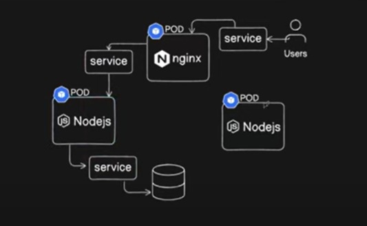


### Dirfferent services in Kubernetes
* Cluster IP
* NodePort
* External Names
* Loadbalancers

#### ClusterIP vs NodePort vs LoadBalancer

Here are the key differences between ClusterIP, NodePort, and LoadBalancer services in Kubernetes:

|Feature|ClusterIP|NodePort|LoadBalancer
|:--------|:----------------:|:--------------------:|:--------------------------:|
|Accessibility|Accessible only within the cluster|Accessible externally via node’s IP|Accessible externally via cloud load balancer|
|Use Cases|Internal communication between services|External access for development/testing|External access for production applications|
|Load Balancing|Load-balanced IP within the cluster|Each node forwards traffic on a specific port|External load balancer distributes traffic|
|IP Addresses|Single virtual IP address|Each node’s IP address|Typically uses a public IP provided by cloud
|Scaling|Scales horizontally with additional pods|Scales horizontally with additional nodes|Scales horizontally with additional nodes|


### NodePort

A NodePort is a type of Kubernetes service that opens a specific port on every node in the cluster. This allows external access to the service by forwarding traffic from that port on each node to the Pods targeted by the service. NodePort is useful when you need to access your application from outside the cluster without using a load balancer.

It works by exposing the service on each node’s IP at a fixed port. A ClusterIP service is automatically created, and the NodePort service forwards requests to it, making the service accessible from outside the cluster.

NodePort is the port where the application exposed (Application will exposed to a perticular port). (range for the NodePort is 30000 - 32767)

targetPort is the port which is application pod is listning on. This is not exposed externally. We are only expose NodePort externally. Node port will redirect the traffic to targetPort .

If I am an external user and if I am accessing the application on the web, I will access on the NodePort (30001). But our application will be listning targetPort (Port 80).

If I am a pod that want to access the frontend application and if I am a backend port, than I will access the port(port where specify on the service/port 80) these two ports are same, but they use to do different tasks.

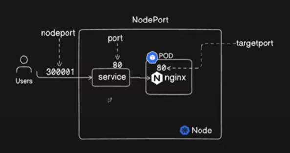
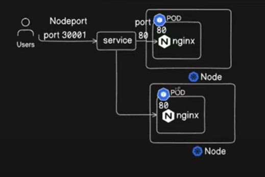

Describe the service-We can get explanation about service using below command and we can find apiVersion and kind with below command.
```
kubectl explain service
```

We can use below commands to get the existing services
```
kubectl get svc
```
or
```
kubectl get service
```
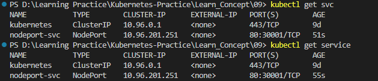

Now our application should be accessible. The way we have created the cluster if it would have been a kubernetes cluster, or any other on premises cluster, this should have been working till now. But since we are using kind, and the way it works in kind cluster, it does not expose your port to the outside world. So, we have to do an extra work only for the kind cluster. It is port mapping. 

You can map extra ports from the nodes to the host machine with "extraPortMappings:"

Applying below commands in a yaml file, we can create a new clsuter with "extraPortMappings:", That's how it expose locally and that's how our application will be accessible.
Since we cannot change the existing cluster in kind we might have to create a new cluster.
You can read documentation for more information : https://kind.sigs.k8s.io/docs/user/quick-start/

```
kind: Cluster
apiVersion: kind.x-k8s.io/v1alpha4
nodes:
- role: control-plane
  extraPortMappings:
  - containerPort: 30001
    hostPort: 30001
- role: worker
- role: worker
```

Use below command to create the new cluster.
```
kind create cluster --config kind.yaml --name cka-cluster3
```
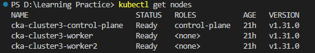

Now let's create the deployment. Let's get a copy of the previous desployment in 08 and apply it here.

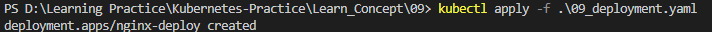

Let's see the list of pods created in deployment.

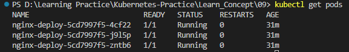

Now let's apply nodeport.yaml which we have created.

```
apiVersion: v1
kind: Service
metadata: 
  name: nodeport-svc
  labels: 
    env: demo-service
spec: 
  type: NodePort
  ports: 
  - nodePort: 30001
    port: 80
    targetPort: 80
  selector: 
    env: demo
```


Let's see the existing service.

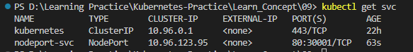

With below command we can get more details about the nodeport. It shows labels, IPs, Port, TargetPort, NodePort...etc
```
kubectl describe svc nodeport-svc
```
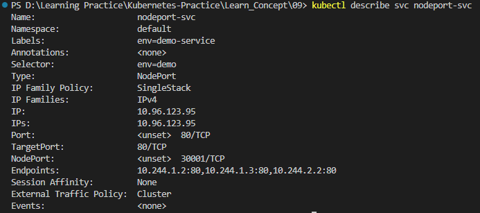

Our main goal is to make the service accessible over port 30001. Now if you run,
```
curl.exe localhost:30001
``` 
Since we are running kind in windows we need to run above command as "curl.exe", but if we are running it on mac or linux we can run it as below without ".exe",
```
curl localhost:30001
``` 
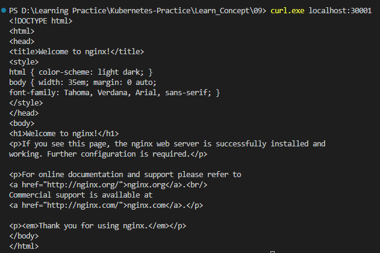

We can try it in our browser as well now.
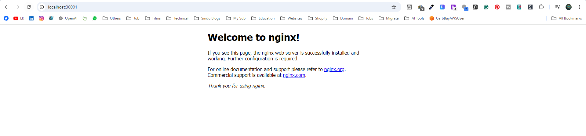

What we did is,
* we re-created the cluster because it is a kind cluster, kind cluster does not expose nodeport externally. So we had to do one extra task creating a new cluster which is with port mapping.
* We created cluster with one control-plane and two worker nodes
* Then we add below part, which says extraPortMapping on the container port 30001, to the host port 30001. That will expose our container port 30001 externally on the host. Through it we can access our application running on the local host.
* Then we created the deployment.
* Then we created the service, our service is now exposed.
```
  extraPortMappings:
  - containerPort: 30001
    hostPort: 30001
```

When we are running our cluster not on kind, by following the steps we did, our service should be accessible on the node that it is running.
For example, let's get a pod and describe the pod to find the node that pod is running. 

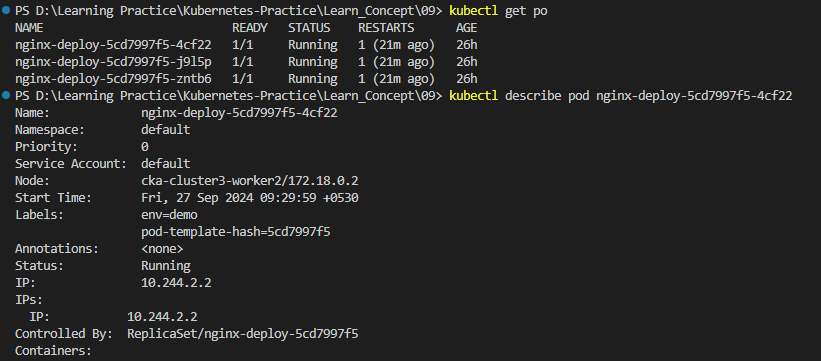

By default our application should be accessible on above ip and port. But because this is a kind cluster it is exposed on localhost. That is the only difference.

```
172.18.0.2:30001
```

### ClusterIP

A ClusterIP is a type of service in Kubernetes that provides an internal IP address for communication within the cluster. It allows different parts of an application (such as Pods) to talk to each other inside the cluster, but it cannot be accessed from outside the cluster. ClusterIP is the most commonly used service type and is also the default. If you create a service without specifying the type, Kubernetes will automatically set the service as ClusterIP.

We can have multiple pods running on front end, and multiple pods running on back end, and we can have data bases as well. Our application has to interract with each other. And these pods should know each other's addresses. There will be internal IP associated with every pod. But that IP is not static. As soon as the pod restart the IP will get changed. 

So how we would communicate with different pods and services. So how would we ensure our pods are accessible on a name or a certain pod by other services. If our back end wants to communicate with our front end pods how would they do that. This is where Cluster IP comming to the picture. 

We create service called(Service Type) Cluster IP. We can access the pods with the name of the service or IPs of the Cluster IP.

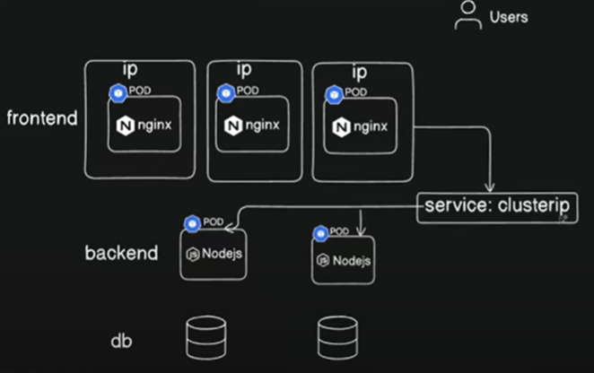

If we list the services it will show us the default Cluster IP and with that we can access this cluster. We can create our own ClusterIP as well. 

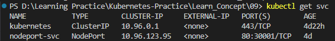

This is how different services and different components interract with each other withing a kubernetes cluster.  

Now let's create Cluster IP with the yaml file we created.

```
apiVersion: v1
kind: Service
metadata: 
  name: clusterip-svc
  labels: 
    env: demo-service
spec: 
  type: ClusterIP
  ports: 
  - port: 80
    targetPort: 80
  selector: 
    env: demo
```
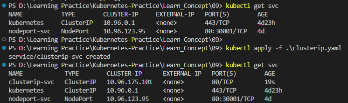

We can get a details of the ClusterIP with bellow command.

```
kubectl describe svc/clusterip-svc
```

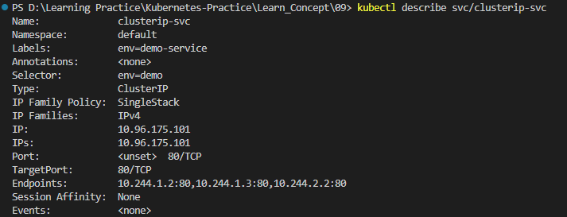

In here this shows parameter called Endpoints. It reprecent the IP addresses of the pods. If we compare it with pods IP addresses we can identify this. We can get Pods IP addresses with bellow command.

```
kubectl get pods -o wide
```

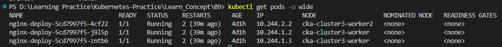

Whenever a pod restart then a new IP will assign to that pod and this Endpoint will also be update over here in the service accordingly and it is listning on port 80.

We can list Endpoints with below commands.

```
kubectl get endpoints

kubectl get ep
```

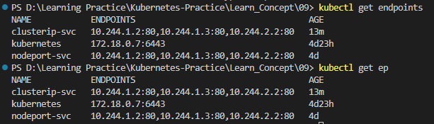

### Loadbalancer 

Every pod has a dedicated IP assigned to it and when the pod restart the IP gets changed. We cannot access the pod from it's IP address. not even internally. Becaiuse IP is not static and it's change time to time. So we need something stays persistence throught the lifecycle of the cluster and it is something that doesn't change. That is why we use Service.

Let's say we have a huge application that is distributed across 50 noes for example so you cannot give 50 IP addresses to your user to access the application that's not just a good practice and that's not what they want. They want something simple like "myapp.com" which they can easily remember or through which they can access the application with just one single URL. For that purpose we use something called as load balancer. 

What it will do is, it will keep all these pods in the back end of this load balancer so whenever user is accessing this application they don't have to really access the separate IP addresses of the pods, they can just directly hit the load balancer URL and load balancer based on the load balancing algorithm it will distribute the traffic across multiple pods. 

In kubernetes we actually create an external load balancer. If you are using a cloud provider such as AWS Azure gcp in that you can provision an external load balancer and then you can use a service type as load balancer inside kubernetes.

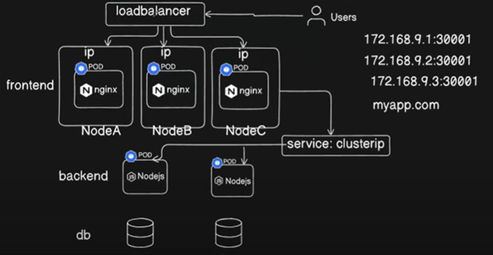

Let's create a loadbalancer with using below yaml.

```
apiVersion: v1
kind: Service
metadata: 
  name: loadbalancer-svc
  labels: 
    env: demo-service
spec: 
  type: LoadBalancer
  ports: 
  - port: 80
    targetPort: 80
  selector: 
    env: demo
```
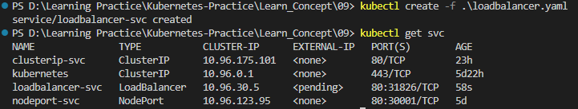

Now we have loadbalancer as loadbalancer-svc, and it does not have External IP. It does not have that external IP because our main purpose of using the load balancer is that we can provide this as an IP address or as a DNS to the external users and they can use it.


### External Name

The difference of the ExternalName from LoadBalancer is, Under the spec: It specify the type as ExternalName and instead of labels we actually map it to a DNS. For example if our database is listning to this particular DNS : "my.database.example.com", that's what we use as externalName.

```
spec:
  type: ExternalName
  externalName: my.database.example.com
```

Now our internal Services can refer to the DNS of our application, so this is why we use external name and it's pretty straightforward as per the naming convention.