## 10 Task

1. Create two namespaces and name them ns1 and ns2

2. Create a deployment with a single replica in each of these namespaces with the image as nginx and name as deploy-ns1 and deploy-ns2, respectively.

3. Get the IP address of each of the pods (Remember the kubectl command for that?)

4. Exec into the pod of deploy-ns1 and try to curl the IP address of the pod running on deploy-ns2. Your pod-to-pod connection should work, and you should be able to get a successful response back.

5. Now scale both of your deployments from 1 to 3 replicas.

6. Create two services to expose both of your deployments and name them svc-ns1 and svc-ns2.

7. exec into each pod and try to curl the IP address of the service running on the other namespace. This curl should work.

8. Now try curling the service name instead of IP. You will notice that you are getting an error and cannot resolve the host.

9. Now use the FQDN of the service and try to curl again, this should work.

10. In the end, delete both the namespaces, which should delete the services and deployments underneath them.


### Answers:

### 1. Create two namespaces and name them ns1 and ns2

With below imperative commands we can create namespaces.

```
kubectl create namespace ns1
kubectl create namespace ns2
```

Also we can create namespaces with creating yaml file for each namespace and applying them. 

```
apiVersion: v1
kind: Namespace
metadata:
  name: ns1
---
apiVersion: v1
kind: Namespace
metadata:
  name: ns2
```

```
kubectl apply -f .\<file_name>.yaml
```

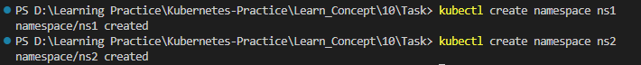


### 2. Create a deployment with a single replica in each of these namespaces with the image as nginx and name as deploy-ns1 and deploy-ns2, respectively.

Create deployments with below commands according to the given requirements.

```
kubectl create deployment deploy-ns1 --image=nginx --namespace=ns1
kubectl create deployment deploy-ns2 --image=nginx --namespace=ns2
```

list deployments with below commands

```
kubectl get deploy --namespace=ns1
kubectl get deploy --namespace=ns2
```

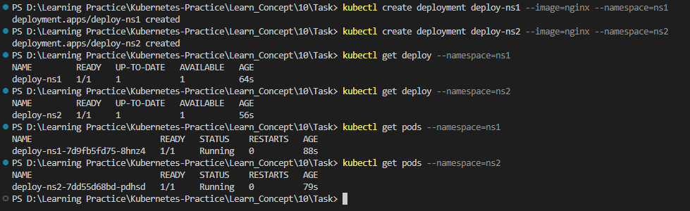


### 3. Get the IP address of each of the pods (Remember the kubectl command for that?)

With below commands we can get the IP addresses of pods in both namespaces.

```
kubectl get pods -o wide --namespace=ns1
kubectl get pods -o wide --namespace=ns2
```

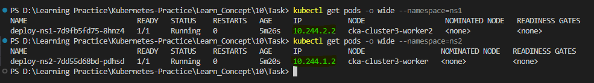


### 4. Exec into the pod of deploy-ns1 and try to curl the IP address of the pod running on deploy-ns2.

```exec``` into pod in ```ns1``` namespace with below command then ```curl``` to IP address ```10.244.1.2``` of ```ns2```.

```
kubectl exec -it deploy-ns1-7d9fb5fd75-8hnz4 -n ns1 -- sh
```

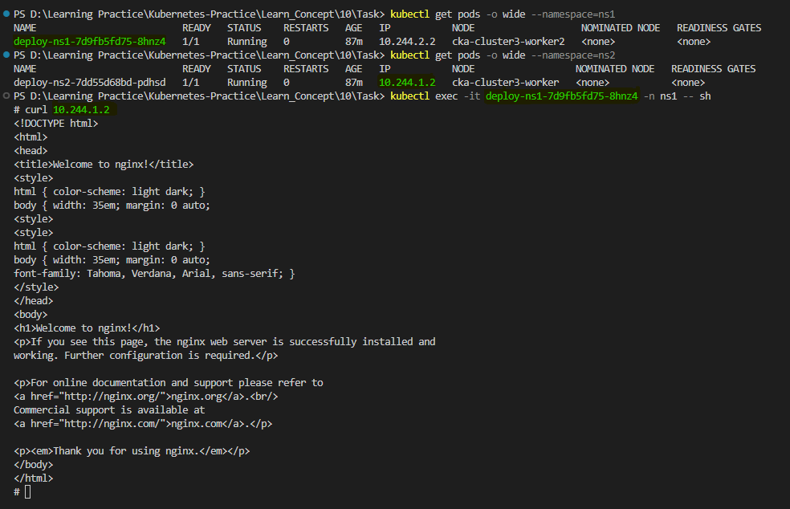


### 5. Now scale both of your deployments from 1 to 3 replicas.

Scale the deployments with below commands.

```
kubectl scale --replicas=3 deploy/deploy-ns1 -n ns1
kubectl scale --replicas=3 deploy/deploy-ns2 -n ns2
```

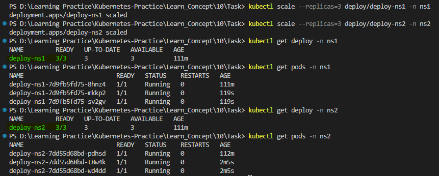


### 6. Create two services to expose both of your deployments and name them svc-ns1 and svc-ns2.

Create service to expose deployment as per the above requirments with below commands.

```
kubectl expose deploy/deploy-ns1 --name=svc-ns1 --port 80 -n ns1
kubectl expose deploy/deploy-ns2 --name=svc-ns2 --port 80 -n ns2
```

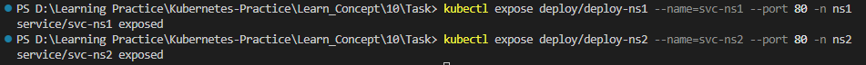


### 7. exec into each pod and try to curl the IP address of the service running on the other namespace.

First get the IP addresses of both services in both namespaces with below commands.

```
kubectl get svc -n ns1
kubectl get svc -n ns2
```

Then I list the pods in ```ns1``` namespace, and copy the 1st pod ```deploy-ns1-7d9fb5fd75-8hnz4``` and exec in to it with below command.

```
kubectl exec -it deploy-ns1-7d9fb5fd75-8hnz4 -n ns1 -- sh
```

Now I tried to curl to IP address of service in ```ns2``` namespace and it worked. Same as this you can curl with other pods as well.

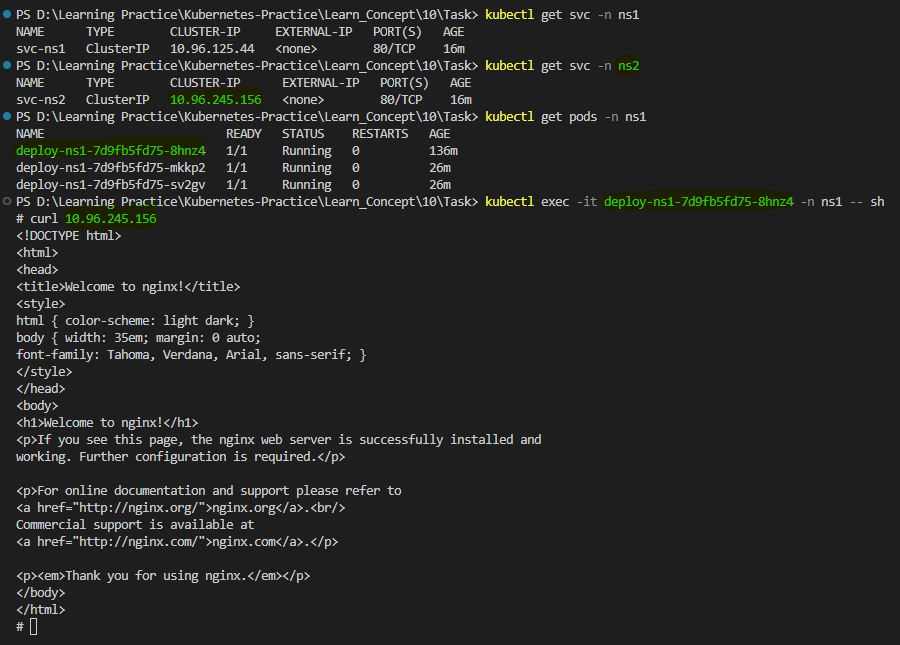


### 8. Now try curling the service name instead of IP. You will notice that you are getting an error and cannot resolve the host.

Try to curl the service name of ```ns2``` namespace instead of IP from inside the 1st pod in ```ns1``` namespace. It didn't go well. Got an error ```Could not resolve host: svc-ns2```

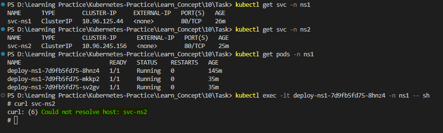


### 9. Now use the FQDN of the service and try to curl again, this should work.

First list the pods in ```ns2``` namespace and ```exec``` in to one of the pod (I will ```exec``` in to 1st pod ```deploy-ns2-7dd55d68bd-pdhsd```) and ```cat``` ```resolv.conf``` file to get the Fully Qualified Domain Name (FQDN).

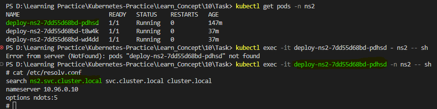

As we can see here FQDN is ```ns2.svc.cluster.local```. Now we can curl to this FQDN from a pod in ```ns1``` namespace. This domain name starts with namespace name. ```<namespace name>.ns2.svc.cluster.local```.

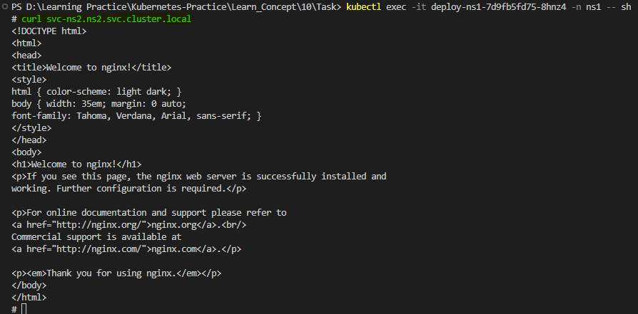

It's working :) 


10. In the end, delete both the namespaces, which should delete the services and deployments underneath them.

Let's delete namespaces with below commands.

```
kubectl delete namespace ns1
kubectl delete namespace ns2
```

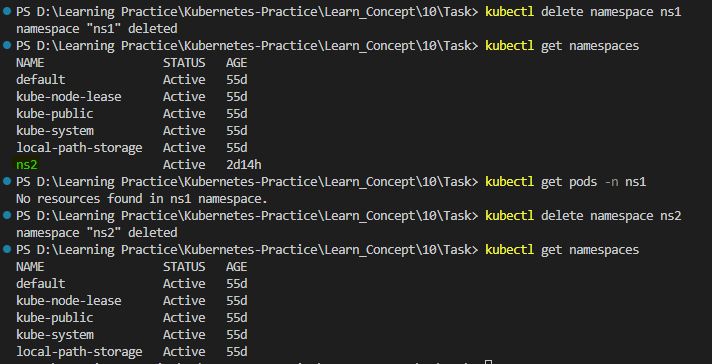

Now you can see that all the services and deployments under these namespaces will also be deleted once we delete the particular namespace.