# Kubernetes – Namespaces

Kubernetes Namespace is a mechanism that enables you to organize resources. It is a logical partitioning mechanism used to divide a single Kubernetes cluster into multiple virtual clusters. It is like a virtual cluster inside the cluster. A namespace isolates the resources from the resources of other namespaces. It allows you to organize and manage resources such as Pods, Services, and ConfigMaps, in isolated environments. Namespaces provide a way to create boundaries within the same cluster, making it possible to manage large-scale deployments, multi-team environments, and various application stages (development, testing, production) efficiently.

Each Kubernetes resource is created in a namespace, and resources in different namespaces are logically separated. This means that resources in one namespace, such as a Pod or Service, won’t interact with resources in another unless explicitly allowed. Namespaces are particularly useful in scenarios where multiple teams or applications share the same Kubernetes cluster, helping to prevent name collisions and allowing for more fine-grained control over resource limits, security, and access control.

Kubernetes comes with some default namespaces like:

* ```default```: The default namespace for resources without a specified namespace.
* ```kube-system```: Reserved for system components of Kubernetes.
* ```kube-public```: Public information that can be accessed across the cluster.

By using namespaces, teams can manage large Kubernetes environments more effectively, ensuring a clean separation between different projects, environments, or departments.

We can list the current namespaces with below commands.

```
kubectl get ns
```
or
```
kubectl get namespace
```

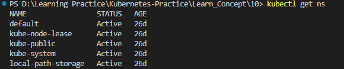

The resources we are creating without specifying any namespace are go in to the default namespace.

```
kube-node-lease      Active   37d
kube-public          Active   37d
kube-system          Active   37d
```

Above namespaces are used by kubernetes for it's own purpose. If we want to check what's inside these namespaces, we can use below command.

```
kubectl get all --namespace=kube-system
```

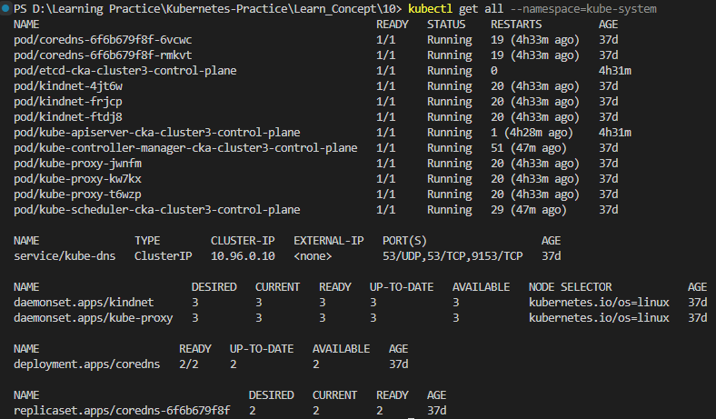

* First couple of lines have control plane components.
* Then we have kube-dns service. kube-dns service is responsible for resolving your IPS to the host name within the cluster.
* Then we have deamon sets. 
* Next we can see deployments and then we can see replicaset.


There are multiple ways to create namespaces. First let's go with the declarative way.

```
apiVersion: v1
kind: Namespace
metadata: 
  name: demo-namespace
```

we don't have to specify spec and these three fields will be sufficient, so we just have to provide the API version name and a kind which is ```Namespace```. Let's apply it with below command.

```
kubectl apply -f .\namespace.yaml
```

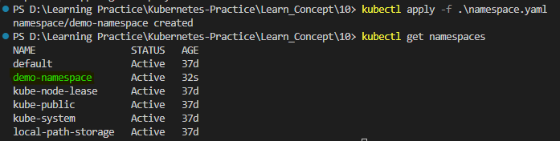

We can delete the namespace with below command.

```
kubectl delete ns/demo-namespace
```


Now, let's create the namespace imperative way. This way is pretty simple and straight forward. Below is the command.

```
kubectl create namespace demo-namespace
```

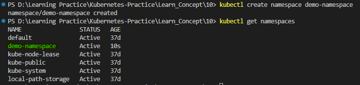


Now, let's create deployment in the ```demo-namespace``` using imperative command.

```
kubectl create deployment nginx-ns-demo --image=nginx --namespace=demo-namespace
```

or

```
kubectl create deploy nginx-ns-demo --image=nginx -n demo-namespace
```


If we run ```kubectl get deploy``` command without specifying a namespace, it will show the deployments in default namespace. So if we want to list the deployments in a specified namespace, we have to run the command specifying the namespace.

```
kubectl get deploy --namespace=demo-namespace
```

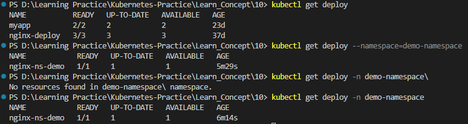

So everytime if you have to interact with a particular namespace, like whether you are getting any resources from that namespace or you are adding or deleting any resources from that namespace you have to specify the namespace name. 

Now, let's check the communication between two namespaces. To do that let's create a new deployment in the default namespace and try to communicate between pod inside ```demo-namespace``` and pod inside default namespace.

Let's create a new deployment inside default namespace with below command. Here we don't need to specify the namespace since we are creating the deployment in the default namespace.

```
kubectl create deploy nginx-test --image=nginx
```

I have split the terminal and left side is demo-namespace and right side is default namespace. Let's get the ip addresses of pods from both namespaces with below command.

```
kubectl get pods -n demo-namespace -o wide
```
```
kubectl get pods -o wide
```

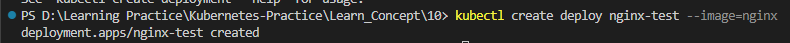

Go to inside the pods with ```exec``` command. 

```
kubectl exec -it nginx-ns-demo-5987d8686c-dn6ps -n demo-namespace -- sh
```
```
kubectl exec -it nginx-test-5b77bfd686-zhqvl -- sh
```

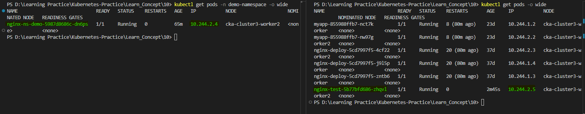

Now let's run ```curl <ip address>``` command to access the particular pod. It is working. We can access another pod inside another namespace.

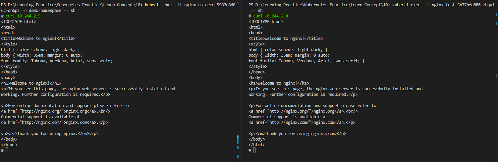


Now let's scale the deployment to 3 replicas in both default and demo-namespace. Let's do it with below commands.

```
kubectl scale --replicas=3 deploy/nginx-ns-demo -n demo-namespace
```
```
kubectl scale --replicas=3 deploy/nginx-test
```

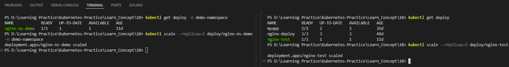

Let's see the sceled deployments in both.

pods in namespace
```
kubectl get pods -n demo-namespace
```

pods in default namespace (nginx-test deployment)
```
kubectl get pods -l app=nginx-test
```

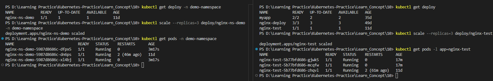


Now let's expose service infrontof particular department in both sides. we can achieve this with below commands.

Below is the command use for demo-namespace
```
kubectl expose deploy/nginx-ns-demo --name=svc-namespace --port 80 -n=demo-namespace
```

Below is the command use for default namespace
```
kubectl expose deploy/nginx-test --name=svc-test --port 80
```

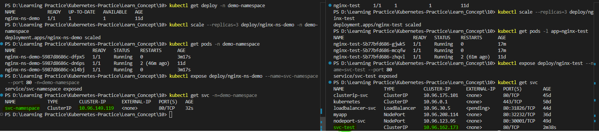

Now, let's check whether we are able to access service in default namespace from one of the pod in demo-namespace and access service in demo-namespace from one of the pod in default namespace. First we have to go inside one of the pods in both namespaces.

get the pods list and access one pod with below command.
```
kubectl exec -it nginx-ns-demo-5987d8686c-dfpx5 -n demo-namespace -- sh
```
```
kubectl exec -it nginx-test-5b77bfd686-gjwk5 -- sh
```

Now if we try to curl with service name it gives output as ```Could not resolve host:```. 

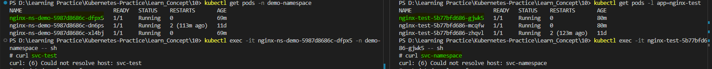

What we can see here is we are able to reach the pods and services from the different namespaces with different IP addresses, but not from their hostname. Let's check the ```resolv.conf``` file in ```/etc/``` directory. This is the file responsible for doing the IP to DNS resolution internally withing the cluster.

Now we can see we have different hostname that we can use. So if we want to access the service inside particular namespace we have to follow this fully qualified domain name in this ```resolv.conf``` file.

This domain name starts with the namespace name ```<namespace-name>```, then service ```svc```, then ```cluster.local``` as ```<namespace-name>.svc.cluster.local```. In default namespace, the namespace name is ```default```. but format is same.


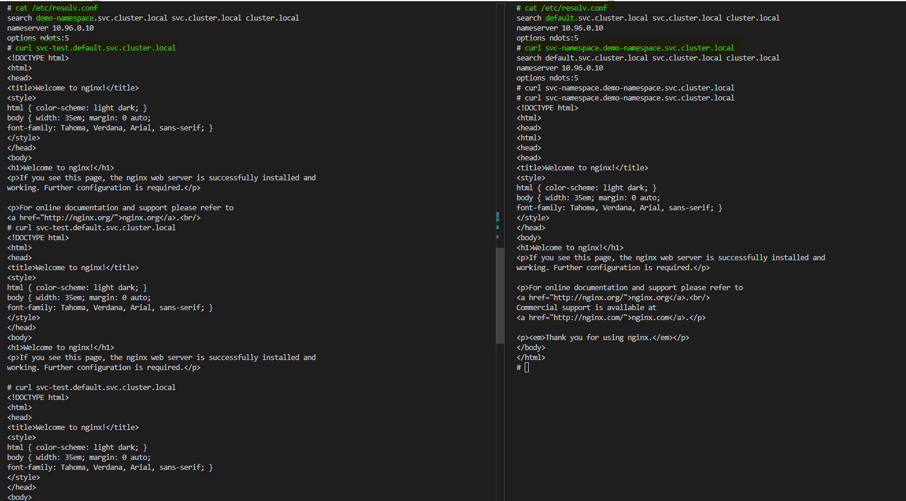

So far we have two namespaces, one is default and other one is demo-namespace. Inside those we have deployment with three pods and similar setup on both sides. We have exposed this deployment with the help of a service. 

Now we know, that if we need to communicate between Pods withing different namespaces, we can use their IP addresses. However, Pod IP addresses are not static. This is why we use a Service to expose the Deployment, or the Pods within the Deployment outside that specific namespace. To access the Service, we cannot use just the hostname; instead, we can use the fully qualified domain name (FQDN). If we are accessing the Service within the same namespace, we can simply use its direct name as the hostname. (eg:- svc-test, svc-namespace)

When accessing the nginx Pod from one namespace, we were able to reach it using its IP address. This means that IP addresses are cluster-wide. The same IP address can be accessed from anywhere within the cluster, even across different namespaces. However, when we tried to access the Service in one namespace from a Pod in another namespace, we encountered an "access denied" error because the hostname could not be resolved.

This indicates that to access a Service across namespaces, we need to use its fully qualified domain name (FQDN). According to the entries in ```/etc/resolv.conf```, hostnames are not cluster-wide; they are namespace-specific. So hostname of a specific service is specific to it's namespace. If there is a Pod within the same namespace, it can easily communicate with the Service using the hostname because the hostname is namespace wide.

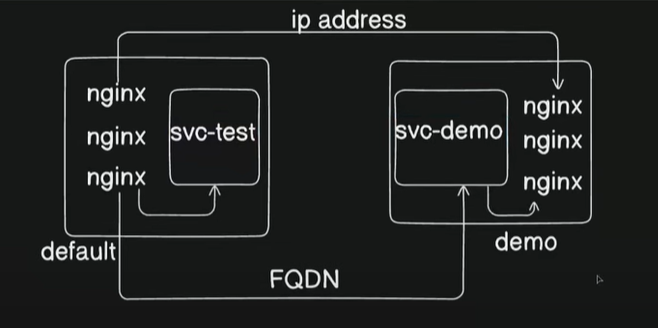