# Kubernetes – Multi Container Pod | Sidecar vs Init Container

A multi-container Pod in Kubernetes is a Pod that contains more than one container running within it. While a typical Pod often runs a single container, Kubernetes allows multiple containers to run within the same Pod, enabling them to share resources and communicate with each other efficiently.

### Characteristics of Multi-Container Pods
1. Shared Resources:
    * Containers in the same Pod share the same network namespace, which means they can communicate using localhost and share the same IP address.
    * They also share the Pod's storage volumes, enabling them to access shared data.

2. Tight Coupling:
    * Containers within a Pod are tightly coupled and are meant to work together to form a single unit of execution.

3. Lifecycle and Scheduling:
    * All containers in a Pod are managed together. They are scheduled on the same node and share the same lifecycle (started, stopped, or restarted together).

Let's say we have a pod running on your kubernetes cluster and it has one app container (let's say nginx). Now we can have additional containers to support this app container. these containers could be an init container or this could be a sidecar container. 
* ```init container:``` initialization container that actually runs before the app container to do certain tasks.
* ```sidecar container:``` sidecar container that runs all the time with the app container and it provides certain input or it takes certain output from the app container. It is also referred to as an helper container.

When the Pod start, the first container that will be started is the init container. As soon as the init container completes and it finishes its work, then only the app container will be started. So starting of app container is totally dependent on the init container and it works according to the app container. So whenever the app container restarts or stops, init container goes down with it. So it works in conjunction with the app container and it shares the resources of the Pod. Let's say we have allocated some memory, some CPU, some storage, to the Pod, all those resources will be shared among all the containers inside that Pod.

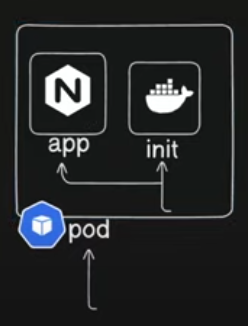

Let's create a pod with below yaml file.

```
apiVersion: v1
kind: Pod
metadata: 
  name: 11app
  labels: 
    name: 11app-pod
spec:
  containers:
  - name: 11app-container
    image: busybox:1.28
    env: 
    - name: FIRSTNAME
      value: "Hasantha"s
```

BusyBox Docker image is a minimal and lightweight base image. It's a type of image that does a specific purpose that run a task and then it exits. That's why it shows status as ```CrashLoopBackOff``` of the container.


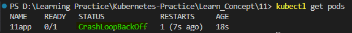

Let's delete this pod and proceed with the multiple containers like init containers we specify above.

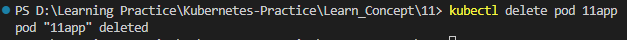

Let's specify init container in our ```pod.taml``` file. Init containers also a list that we can have multiple init containers. Let's initialize our first init container as ```init-myservice```. Again iside that we will use busybox image. Then we use commands and arguments.

* command: command is the command that you have to pass to your container. This could be a simple shell command or this could be a simple unix command. for that we are using a format ```['sh', '-c']```. we are separating the command with comma.
* arguments: We have to pass certain arguments to the command. That arguments will go over argument section. 

What we are going to do is we use ```nslookup``` command and ```nslookup``` command will only work when the service is available and exposed. We can use the ```nslookup``` command within a pod to resolve service names or other DNS entries within the cluster.

Key Points:

* Service Discovery: Kubernetes uses a service discovery mechanism that translates service names into IP addresses.
* DNS Resolution: nslookup leverages this mechanism to resolve service names within the cluster.
* Pod Context: You must execute nslookup within a pod to utilize the cluster's DNS resolution capabilities.

Below is the explanation of the argument we are going to write. It is a waiting loop to ensure a Kubernetes service is accessible before proceeding.

```args: ['until nslookup myservice.default.svc.cluster.local; do echo waiting for service to be up; sleep 2; done']```

* ```until``` loop: This loop continues to execute the commands within it until the condition within the until statement is met.
* ```nslookup myservice.default.svc.cluster.local```: This command attempts to resolve the DNS name of the Kubernetes service named "myservice" in the "default" namespace. If the service is not yet available, ```nslookup``` will likely fail.
* ```do echo waiting for service to be up; sleep 2; done```: This block of code executes within the loop:
  * ```echo waiting for service to be up;```: Prints a message to the console indicating that the service is not yet available.
  * ```sleep 2;```: Pauses the script for 2 seconds before attempting to resolve the service again.

Now let's add the command to main container. Else it will fail as above. I am adding it in a single line. As below we can write command and argument in a single line.

```command: ['sh', '-c', 'echo the app is running && sleep 3600']```

Now let's apply the yaml.

```
apiVersion: v1
kind: Pod
metadata: 
  name: 11app
  labels: 
    name: 11app-pod
spec:
  containers:
  - name: 11app-container
    image: busybox:1.28
    command: ['sh', '-c', 'echo the app is running && sleep 3600']
    env: 
    - name: FIRSTNAME
      value: "Hasantha"
  initContainers:
  - name: init-myservice
    image: busybox:1.28
    command: ['sh', '-c']
    args: ['until nslookup myservice.default.svc.cluster.local; do echo waiting for service to be up; sleep 2; done']
```

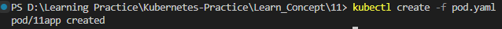

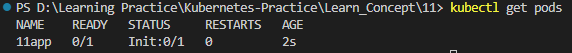

Here shows ```READY``` is 0 out of 1 ```0/1```. That means one pod is still not ready. ```STATUS``` shows ```init:0/1``` init 0 out of 1. Init containers that it has, only 0 is available out of 1. It is not running and it is stuck in initialisation state. 

init container try ```nslookup``` on the service host name "fqdn" ```myservice.default.svc.cluster.local``` and until it gets the response it keeps on trying after every 2 seconds. If we check the logs it will show it keep writing the message ```waiting for service to be up```.

Check the logs of the 11app pod ```kubectl logs pod/11app```

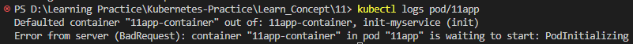

Check the logs of the init-myservice pod ```kubectl logs pod/11app -c init-myservice```. 
```-c init-myservice```: This option specifies the specific container within the pod whose logs you want to view.

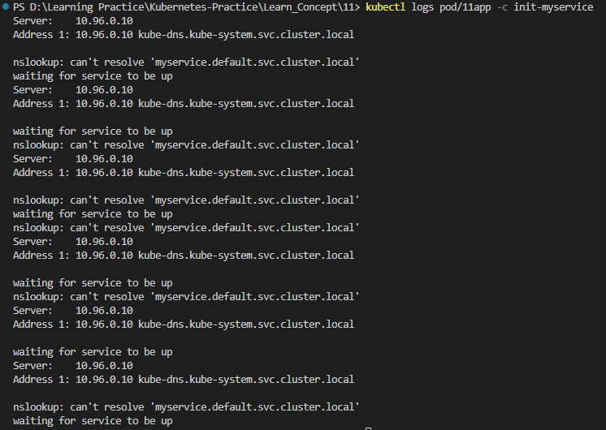


Now let's create a deployment and expose the service ```myservice```. 

With below comman we create a deployment ```nginx-deploy``` and service ```myservice```, then expose the service to port 80. Service type of this service is Cluster IP. The command defaults to creating a ClusterIP Service, which means it will have an internal IP address within the cluster. To expose the service outside the cluster, we need to specify a different Service type like ```NodePort``` or ```LoadBalancer```.

Create Deployment
```kubectl create deploy nginx-deploy --image nginx --port 80
```

Expose the service
```
kubectl expose deploy nginx-deploy --name myservice --port 80
```

Once we expose the service, we can observe the pod transition through the following states: Init:0/1 -> PodInitializing -> Running.

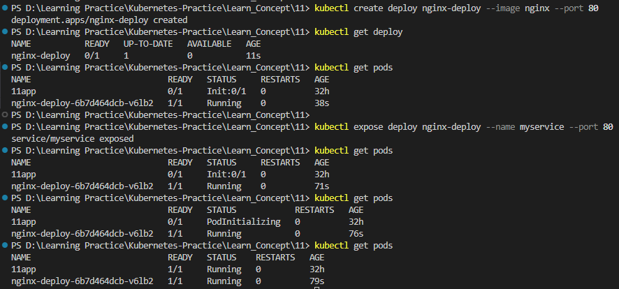

That means init container has completed and now the 11app container is up and running. Because the service is now expose and now we can do ```nslookup``` on the service name. Because it is now provisioned.  

Now, if we check the logs we can see it is getting the response back. we are getting the response ```myservice.default.svc.cluster.local```. After that it was stop the printing messages because after that init container job has been done. 

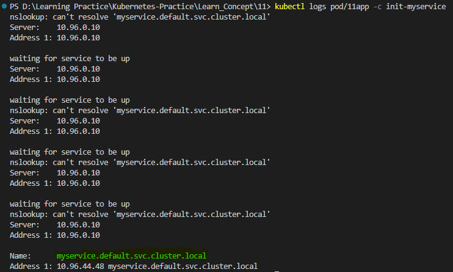

Now let's check the environment variable we have set. We can check it with below command without entering the container with ```exec``` command.

```kubectl exec -it 11app -- printenv```

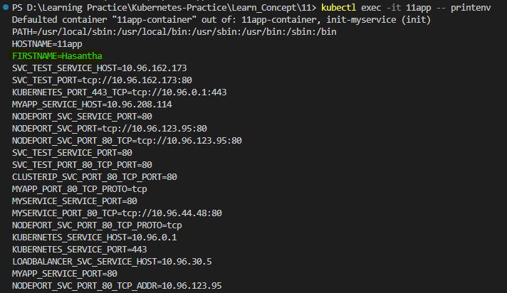

We can indeed check the environment variables within a running container by typing ```sh``` after entering the container. Now we can actually enter not just one container. It currently default to 11app-container. But we can enter inside the init-container as well for debugging purpose with ```-c```. 

```kubectl exec -it <pod-name> -c <container-name> -- bash```

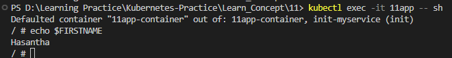

The way we have created single init-container, we can have multiple containers for multiple reasons. Let's create one more.

