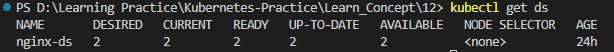
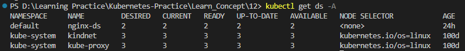
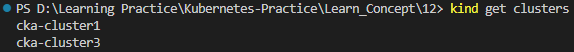
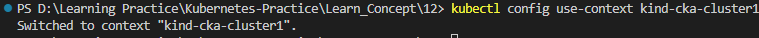
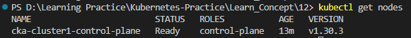
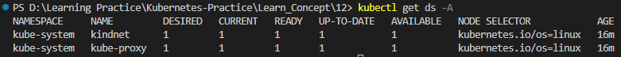

# Kubernetes - Daemonsets, Job and Cronjob

A DaemonSet is a deployment mechanism that ensures a single pod of a specific type runs on every node in a cluster. Whenever a new node is added to the cluster, It automatically deploys the pod on it, and when a node is removed, the pod will also be deleted. If the DaemonSet itself is removed, all the pods it created will also be deleted.

In ReplicaSet we are the one who decide how many replicas we want. Pods are spread across the cluster nodes. Some nodes may have no Pods, while others have multiple. 

DaemonSets are commonly used for tasks like running background services on every node, such as: 
* system maintenance, 
* log collection, 
* monitoring tools like Prometheus, or managing storage volumes.

### Key Characteristics:

* **Node-Level Deployment:** Unlike Deployments, which manage a fixed number of replicas, DaemonSets aim to run a single instance of the specified pod on each eligible node in the cluster.
* **Self-Healing:** If a DaemonSet pod on a node fails or the node itself is removed, the DaemonSet controller automatically creates a new pod on a replacement node.
* **Node-Level Services:** DaemonSets are often used for deploying node-level services, such as:
    * **Log collection agents:** (e.g., Fluentd, Logstash) to collect logs from all nodes.
    * **Monitoring agents:** (e.g., Prometheus Node Exporter) to gather node-level metrics.
    * **Network plugins:** To provide network functionality for the cluster.
    * **Storage daemons:** For managing local storage on nodes.

### How it Works:

1. **Creation:** When you create a DaemonSet, you define the desired pod specification.
2. **Pod Creation:** The DaemonSet controller analyzes the cluster nodes and creates a pod for the specified pod template on each eligible node.
3. **Maintenance:** The controller continuously monitors the cluster and ensures that:
    * A pod is running on each eligible node.
    * If a pod fails or a node is removed, a new pod is created on a replacement node.

Let's create DaemonSet with ```ds.yaml``` file. The yaml is almost the same as Deployment (specifications are same as the Deployment). 

In a Deployment, we specify the number of replicas to run. The controller and scheduler handle scheduling the pods based on resource availability on the nodes, as well as other constraints such as resource requests and limits. Unlike a Deployment, a DaemonSet ignores the specified number of replicas. Instead, it ensures that one replica of the pod is created on each available node.

So we don't need ```replicas``` field in DaemonSet yaml. 

```
apiVersion: apps/v1 
kind: DaemonSet
metadata: 
  name: nginx-ds
  labels:
    env: ds-demo
spec: 
  template:
    metadata:
      labels: 
        env: ds-demo
      name: nginx
    spec:
      containers:
      - image: nginx
        name: nginx-dspod
        ports: 
        - containerPort: 80
  selector: 
    matchLabels: 
      env: ds-demo 
```


If we list the ```pods``` and ```nodes```, we can observe three nodes but only two pods. This is because the control plane node has a ```taint``` applied, which prevents regular workloads from being scheduled on it. Only control plane components are allowed to run on these nodes unless explicitly tolerated. The pod we deployed is a custom workload and is not part of the control plane components, so it cannot tolerate the taint. As a result, it is not scheduled on the control plane node.


Let's delete one of the Pods. We will see that two Pods are running once again, but with a different name for the replaced Pod. This happens because the Deployment (or ReplicaSet) automatically recreates the missing Pod to maintain the desired number of replicas.


Let's list DaemonSets with ```kubectl get ds``` command.



* **NAME:** Name of the DaemonSet.
* **DESIRED:** Number of nodes that should be running the pod.
* **CURRENT:** Number of nodes that are currently running the pod.
* **READY:** Number of nodes that are running a pod and are ready.
* **UP-TO-DATE:** Number of nodes that have the latest pod version.
* **AVAILABLE:** Number of nodes with a pod available to serve requests.
* **NODE SELECTOR:** Node selector criteria for scheduling the DaemonSet.
* **AGE:** Time since the DaemonSet was created.

Also we can list DaemonSets in a specific namespace with ```kubectl get ds -n <namespace>```

With ```kubectl get ds -A``` command we can lists all DaemonSets across all namespaces in the Kubernetes cluster.



Here we can see there are two DaemonSets in ```kube-system``` namespace. ```kindnet``` is created by kind for networking. Other one is ```kube-proxy``` with 3 DESIRED, 3 READY and 3 AVAILABLE replicas. We have 3 nodes in current cluster ```cka-cluster3``` and it deployed ```kube-proxy``` in all 3 nodes.

Let's check the same in single node cluster we have. list current clusters with ```kind get clusters``` command.



Let's switch to ```cka-cluster1``` with ```kubectl config use-context kind-cka-cluster1``` command.



If we list nodes, we can see there is only one node available in this cluster which is the control-plane node.



Now let's lists all DaemonSets across all namespaces in the current cluster ```cka-cluster1```.



Here we can see in both the ```kube-proxy``` and ```kindnet``` DaemonSets have 1 DESIRED, 1 READY and 1 AVAILABLE replicas. This is because we have only 1 available node in current cluster ```cka-cluster1```. Therefore, the DaemonSets have deployed a single pod on this node. 