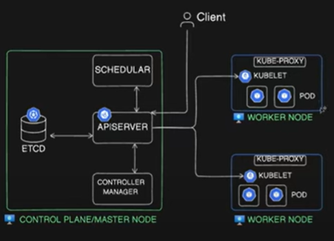
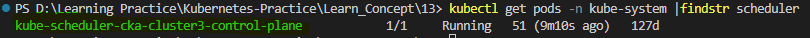
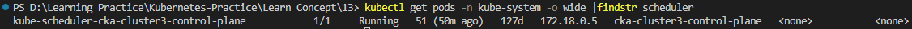
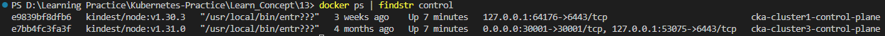
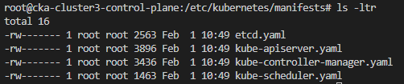

# Static Pods, Manual Scheduling, Labels, and Selectors in Kubernetes

### Static Pods



Above image is a kubernetes sample architecture diagram with the control plane on the left with the control plane components and kubelets, kubeproxy and some workloads on the right side running on the worker nodes. When we have multiple workloads running in either of the nodes or if we have multiple nodes as well, Schuler decides which pod has to go on which node. (scheduler responsible for deciding which pod has to go on which node). Let's assume we have provisioned a new pod and we have sent the request to create a new pod. This request will go to API server, API server creates an entry in the HCD database to create the pod, and then scheduler checks to which particular node out of the available nodes has to schedule this particular pod on. Because schedular is monitoring this particular pod or every single pod that is running or that is yet to run on the server. It is continuously monitoring it. This is based on uh the scheduling algorithm and various other factors. It basically sends that request to the kubelet. like it provides the details to the API server and API server sends the request to the kubelet on that particular node. Instruct the kubelet to run this pod on this particular node and the pod will be provisioned. Then kubelet will send the request back to API server and it will update the entry in the HCD database. And then it will send the response back to the client let's saying that your pod has been created. So the main component uh that is involved in this scheduling is scheduler. Scheduler is the one who takes the decision and send the request to kubelet to provision the pod or any pod.

Schedular as along with API server and other components (Controller Manager, HCD Database) is a control plane component. It has to be running all the time and and it is running as a pod. Let's check it with below command.

```
kubectl get pods -n kube-system |findstr scheduler
```



Here ```findstr``` is equal to ```grep``` command in linux. 

So we can see ```kube-scheduler-cka-cluster3-control-plane``` is running as a pod. Scheduler is responsible for scheduling the pods, but if schedular itself is a pod, who's responsible for running it?

Reason for that is: there is a concept in kubernetes call ```static pods```. 

**Static pods are a special type of pod that runs directly on a specific node without being managed by the Kubernetes Control Plane (API Server, Scheduler, etc.). Instead, they are managed by the kubelet on that node. Unlike Pods that are managed by the control plane, Static Pods are always bound to one Kubelet on a specific node.**

Let's get additional details such as node name and IP of that static pod that runs the scheduler with below command.

```
kubectl get pods -n kube-system -o wide |findstr scheduler
```



This ```cka-cluster3-control-plane``` is the ```node```  this particular pod runs on.

If we were using a kubernetes cluster on any cloud or on VMware or on bare metal servers, this particular node would be a virtual machine and we can directly SSH into that and if it was a Windows machine we can RDP into that. 

However, since we are using a Kind cluster, (kind is kubernetes in Docker) it creates multiple containers and treat those containers as the nodes. In this cluster, we have three nodes, that means we have three containers and those three containers are acting as nodes. Unlike virtual machines, we do not SSH into containers. Instead, we use the docker exec command to access them.

To identify the container that acting as this particular node, let's run below ```docker ps``` command. 

```
docker ps | findstr control
```



Now let's run ```docker exec``` command to access the container ```cka-cluster3-control-plane```.

```
docker exec -it cka-cluster3-control-plane bash
```

```/etc/kubernetes/manifests``` : this is the directory where all the yaml files of thr static pods are stored.



Here we have etcd, kube-apiserver, kube-controller-manager and kube-scheduler.

At times, you may need to restart the control plane components or troubleshoot issues when they are not functioning correctly. In such cases, you can navigate to a specific directory on the control plane node to verify the YAML configuration files. It is essential to ensure that these YAML files are present in the directory because the kubelet constantly monitors it.

If you move a YAML file, such as the ```kube-scheduler.yaml```, to a temporary directory, it effectively removes it from the monitored location. As a result, the ```kube-scheduler``` will no longer be running. However, this does not cause the control plane to go down. instead, it affects the scheduler's ability to perform its tasks.

The scheduler is responsible for assigning new pods to nodes. Existing pods will continue running unless they fail. However, if you attempt to schedule a new pod, it will appear as ```Created``` but remain stuck in the ```Pending``` state. This happens because the scheduler, which is responsible for placing the pod on a node, is no longer running.

### Manual Scheduling

This is not the only way Schuler schedules its pod there is a concept of manual scheduling